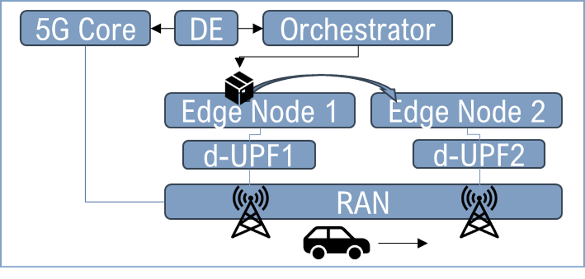

# Cell-aware edge service migration

An edge application that follows a moving vehicle between cells, driven by
session events from the 5G core.

When a vehicle hands over from one gNB to another, the edge node that was
closest to it no longer is. This repository holds the mechanism that notices
the handover and moves the workload: a **Decision Engine** that subscribes to
data-session events on the 5G core, maps the reported gNB to an edge site, and
asks the service orchestrator to re-pin the application there — along with the
Kubernetes operator design that came out of building it.



Built for **SUCCESS-6G**, a Spanish national research project, and used for the
results in a [BalkanCom 2025 paper](#publication).

---

## The idea in one paragraph

A 5G core already knows which cell every subscriber is camped on, and most
cores will tell you about it: register a callback, get a POST on every session
event. That is enough to drive placement. The Decision Engine sits beside the
core, filters events down to the subscriber it cares about, looks the gNB up in
a small topology table, and — if the edge application is not already on the
node serving that cell — rewrites the site label on the deployed workload and
waits for the orchestrator to finish moving it. The move is measured, because
how long it takes is the thing that decides whether the approach is usable.

→ **[How migration is triggered](docs/mechanism.md)** — the signal, the
decision, the action, and what the approach does not handle.

## Layout

| Path | What it is |
|---|---|
| [`decision-engine/`](decision-engine/) | The engine: a Flask service that subscribes to core events and drives the orchestrator |
| [`charts/decision-engine/`](charts/decision-engine/) | Deploys the engine, registering and removing its event subscription through lifecycle hooks |
| [`charts/kserve-inference/`](charts/kserve-inference/) | The edge workload: a KServe model server, optionally with a mediator writing results to InfluxDB |
| [`operator/`](operator/) | Design for moving the placement logic into a Kubernetes operator — CRDs, reconcile sketches, sequence diagram |
| [`examples/`](examples/) | Manage subscriptions on the core; replay synthetic handover events at the engine |
| [`docs/`](docs/) | [Mechanism](docs/mechanism.md), [testbed](docs/testbed.md), [how the engine evolved](docs/evolution.md) |

## Running it

The engine needs an orchestrator to talk to and a topology table. Nothing is
hardcoded, and it will refuse to start rather than guess:

```bash
cp decision-engine/.env.example decision-engine/.env   # then fill it in
cp decision-engine/app/topology.example.yaml topology.yaml
```

```bash
docker build -t cell-aware-decision-engine decision-engine/
```

On a cluster, create the two secrets the chart expects and install it:

```bash
kubectl create secret generic decision-engine-orchestrator \
  --from-literal=user=you@example.com --from-literal=password=CHANGEME
```

```bash
helm install de charts/decision-engine -f my-values.yaml
```

To exercise the migration path without a radio, feed it synthetic events:

```bash
./examples/replay_event.py --supi 001010000000000 --gnb-id 21
```

See [the testbed notes](docs/testbed.md) for what the trial actually ran on and
what the engine assumes of a core and an orchestrator.

## Scope

This repository contains the network-aware application and the operator design
— the parts that were mine to write. It does not contain, and does not need:

- **The 5G core.** The trial used Druid Software's Raemis, a commercial product
  with its own vendor Helm charts. Described in [the testbed notes](docs/testbed.md),
  not redistributed here.
- **The orchestrator.** Service orchestration was done by
  [NearbyOne](https://www.nearbycomputing.com/). The engine is a client of its
  northbound API; none of its code is here. The API calls the engine makes —
  list services, change a site label, poll for sync — are documented in
  [the mechanism notes](docs/mechanism.md) and are ordinary enough that another
  orchestrator could stand in.
- **The model.** The vehicle condition-monitoring model was a partner
  contribution. The charts that serve it are here; its weights are not.

Endpoints, credentials and status strings are all configuration, so nothing
here is bound to either vendor.

## Publication

The mechanism and its measurements were published as:

> R. Sanchez-Mateos Lizcano *et al.*, "AI-Driven Vehicle Condition Monitoring
> with Cell-Aware Edge Service Migration," *2025 International Balkan
> Conference on Communications and Networking (BalkanCom)*, 2025.
> [doi:10.1109/BalkanCom65827.2025.11185956](https://doi.org/10.1109/BalkanCom65827.2025.11185956)

The service migration mechanism in this repository is my contribution to that
paper, which is the work of thirteen authors across the project consortium.

## Acknowledgements

This work was carried out within **SUCCESS-6G**, funded by the Spanish national
research programme, at [Nearby Computing](https://www.nearbycomputing.com/) and
with the project's partner consortium. Service orchestration was provided by
the NearbyOne platform; the 5G core by Druid Software's Raemis.

## Licence

Code is [Apache-2.0](LICENSE). Documentation and figures are
[CC BY 4.0](https://creativecommons.org/licenses/by/4.0/).
