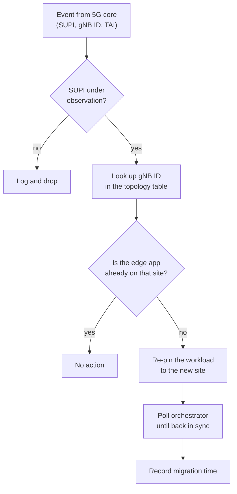
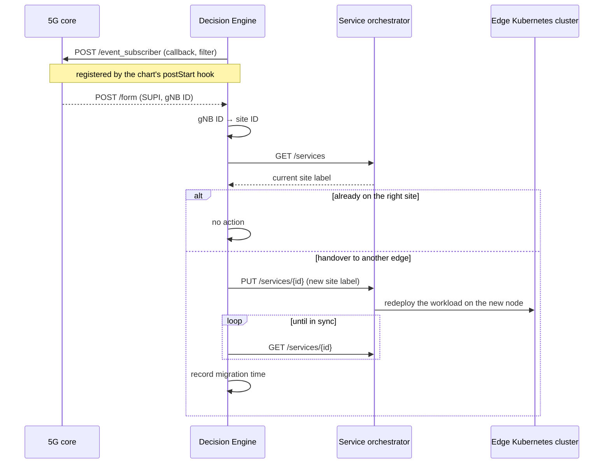

# How migration is triggered

## The signal

A 5G core knows, at all times, which gNB a subscriber is camped on. It also
offers an event-subscription API: register a callback URL and a filter, and the
core POSTs a form to that URL whenever a matching session event occurs. The
payload carries a JSON document with the subscriber's SUPI, the gNB ID, the
tracking area and the APN.

That is the whole signal. No probe, no RAN integration, no agent on the vehicle
— the core already tracks the handover, and it will tell you about it.

## The decision

The Decision Engine turns that signal into a placement:



The topology table is the only piece of static configuration: one row per edge
node, saying which gNB it serves, which UPF terminates the user plane there,
and which orchestrator site ID pins a workload to it.

```yaml
edges:
  edge1: {upf: upf1, gnb_id: 10, tai: tai1, site_id: "…0001", redis_host: edge1…}
  edge2: {upf: upf2, gnb_id: 21, tai: tai2, site_id: "…0002", redis_host: edge2…}
```

## The action

The engine is a northbound-interface client. It authenticates against the
orchestrator, asks for the service, reads the site label out of the deployed
chart's values, and — if that label does not match the edge serving the new
gNB — writes the new label back with a `PUT`.



The orchestrator does the rest: it tears down the release on the old node and
creates one on the new node. From the engine's point of view a migration is a
single field change plus a wait.

## What makes it "cell-aware"

Two details stop this from being a plain redeploy.

**The user plane has to follow too.** Each edge node sits behind its own
distributed UPF. Moving the workload without moving the user-plane anchor just
adds a backhaul hop and defeats the point. The topology table pairs each gNB
with both its UPF and its site, so the two stay aligned.

**The application's state is edge-local.** The workload keeps its state in a
Redis instance on the same node. So the engine rewrites `REDIS_HOST` in the
same update that changes the site label — otherwise the migrated pod would
start up pointing at an endpoint one site behind.

## What it does not do

The mapping is static, hand-maintained, and one-to-one: one gNB per edge. The
engine tracks one SUPI. There is no hysteresis, so a UE oscillating on a cell
boundary would migrate the service back and forth. These were acceptable for a
trial with one vehicle and two cells, and they are the first things that would
have to change for anything larger — which is part of what motivated the
[operator design](../operator/README.md).
