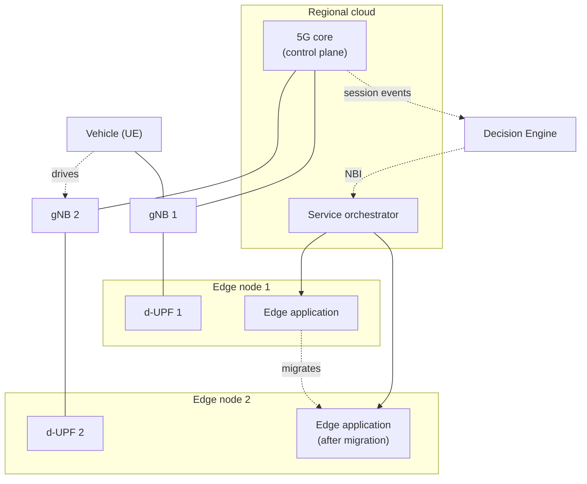

# Testbed

The trial ran on a two-edge topology with a real 5G core, a real radio, and a
vehicle driving between two cells.



## Components

| Component | What it is | Published here |
|---|---|---|
| 5G core and d-UPFs | Druid Software **Raemis**, a commercial 5G core. Deployed as one control plane in the regional cloud plus a distributed UPF per edge node | **No** — vendor software and vendor Helm charts |
| Multus | Secondary network interfaces, so each UPF gets its own data-plane NIC | No — [upstream project](https://github.com/k8snetworkplumbingwg/multus-cni) |
| Service orchestrator | NearbyOne, orchestrating edge applications across the two sites through its northbound API | **No** — commercial product |
| Decision Engine | The network-aware application in this repository | **Yes** |
| Edge application | A KServe-served model doing vehicle condition monitoring, with a mediator writing inference results to InfluxDB | **Yes** — charts only, not the model |

## Why the vendor parts are not here

The 5G core is Druid Software's commercial product and the UPF connects to it
over a proprietary interface. Their Helm charts carry no licence that would let
them be redistributed, so they are described rather than shipped. The same goes
for the orchestrator: this repository talks to its northbound API and documents
the request shapes, but contains none of its code.

The interfaces the Decision Engine actually depends on are narrow and ordinary:

- an event-subscription API on the core that POSTs a form to a callback URL
- an orchestrator API that lists services and accepts a `PUT` changing which
  site a workload is pinned to

Any core and any orchestrator offering those two things would work. Nothing in
`decision-engine/` is specific to either vendor beyond the shape of the JSON,
which is why the endpoints, credentials and status strings are all
configuration rather than constants.

## Reproducing it

You do not need the same hardware to exercise the logic. With any orchestrator
that exposes a comparable API, `examples/replay_event.py` will drive the
migration path end to end by feeding the engine synthetic handover events:

```bash
./examples/replay_event.py --supi 001010000000000 --gnb-id 10
./examples/replay_event.py --supi 001010000000000 --gnb-id 21   # handover
```

The second call should produce a migration and a timing record in
`/app/data/migration_times.json`.
