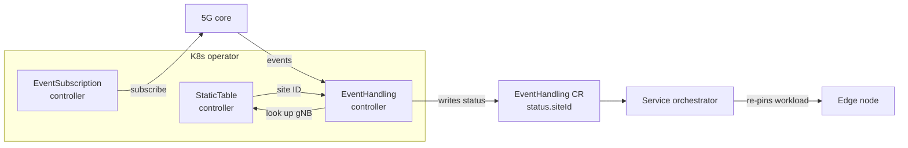

# Operator design

The Decision Engine works, but it keeps the placement logic in an application
that sits beside Kubernetes rather than inside it. This directory holds the
design for moving that logic into a Kubernetes operator, so the mapping, the
subscription and the placement decision each become a reconciled resource.

Three controllers, three CRDs:

| CRD | Controller responsibility |
|---|---|
| `StaticTable` | Holds the gNB-to-edge-site mapping and validates it |
| `EventSubscription` | Registers the event subscription with the 5G core and tracks it |
| `EventHandling` | Receives events, resolves the gNB to a site, and writes the result to its own `status` |

The orchestrator then watches the `EventHandling` status and re-pins the edge
application, rather than being driven by an external client.

- `crds/` — the three CustomResourceDefinitions
- `examples/` — one example Custom Resource per CRD
- `design/` — reconcile-loop sketches
- `sequence-diagram.puml` — how the three controllers interact

> **These are design artefacts, not a working operator.** The `.go` files in
> `design/` are excerpts of reconcile logic written to think the design
> through; they are not a buildable kubebuilder project, and they do not
> compile on their own. The CRDs are valid and do apply to a cluster.

## Why this was not finished

The project delivered its results through the Decision Engine, and the
operator work stopped at the design stage when the vehicular trial concluded.
It is published here because the design is the interesting part: it shows
where the placement logic belongs once the mechanism is understood.
